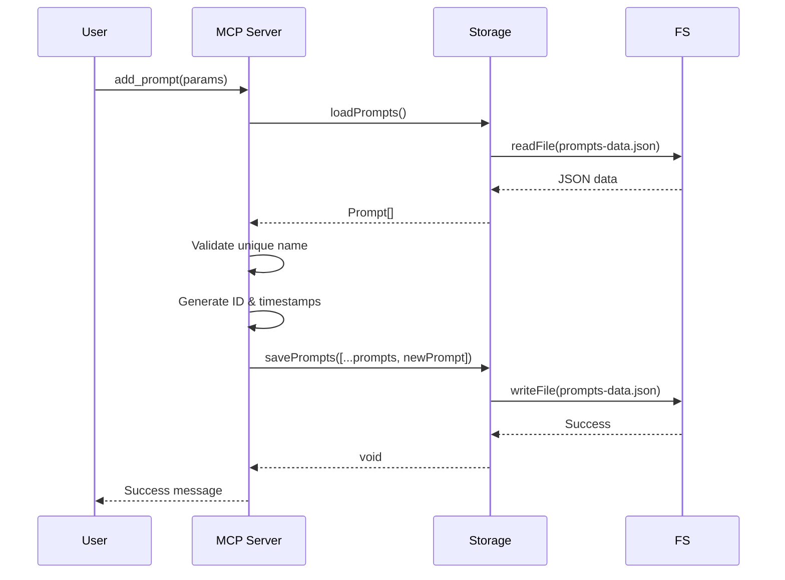
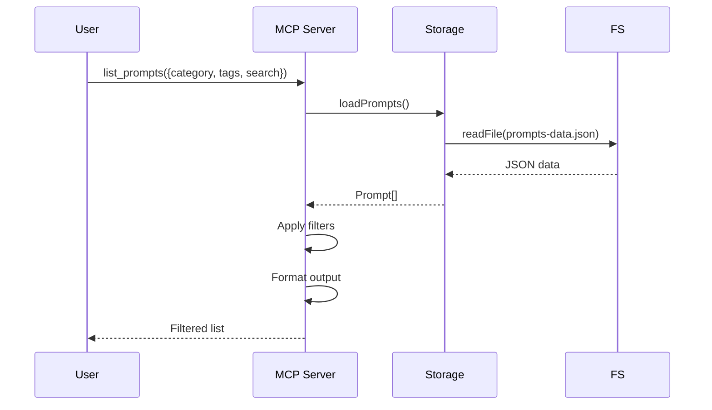

# Arquitetura do MCP AI Prompts Management

## Resumo

Documenta\u00e7\u00e3o completa da arquitetura do servidor MCP, incluindo estrutura de m\u00f3dulos, ferramentas dispon\u00edveis, padr\u00f5es de armazenamento e fluxo de dados

## Contexto

* **Contexto**: backend
* **Tipo**: architecture
* **Tópicos**: mcp-tools, storage, architecture, types

## Conteúdo

### Visão Geral

O **MCP AI Prompts Management** é um servidor MCP (Model Context Protocol) desenvolvido em Node.js/TypeScript que permite gerenciar uma coleção pessoal de prompts de AI de forma organizada e eficiente.

#### Características Principais

* ✅ Armazenamento persistente em arquivo JSON
* ✅ 7 ferramentas MCP para gerenciamento completo
* ✅ Categorização e sistema de tags
* ✅ Busca avançada por nome, categoria e tags
* ✅ IDs únicos gerados automaticamente
* ✅ Timestamps automáticos de criação e atualização

### Arquitetura de Módulos

```
src/
├── index.ts       # Servidor MCP principal + handlers
├── storage.ts     # Camada de persistência
└── types.ts       # Contratos TypeScript
```

#### index.ts - Servidor MCP

**Responsabilidades:**
* Inicialização do servidor MCP
* Registro de ferramentas (tools)
* Handlers de requisições
* Validação de parâmetros
* Tratamento de erros

**Padrões Implementados:**
* Request handlers para `ListToolsRequestSchema` e `CallToolRequestSchema`
* Transport via `StdioServerTransport`
* Error handling com `McpError`

#### storage.ts - Camada de Persistência

**Responsabilidades:**
* Leitura e escrita do arquivo JSON
* Geração de IDs únicos
* Abstração do sistema de arquivos

**Funções:**

```typescript
loadPrompts(): Promise<Prompt[]>
savePrompts(prompts: Prompt[]): Promise<void>
generateId(): string
```

**Padrão de Armazenamento:**
* Arquivo: `prompts-data.json` (criado automaticamente)
* Estrutura: `{ "prompts": [...] }`
* Encoding: UTF-8
* Formatação: JSON com indentação (2 espaços)

#### types.ts - Contratos

Define as interfaces TypeScript que garantem type safety:

* `Prompt` - Estrutura de um prompt (contrato principal)
* `PromptsStorage` - Estrutura do arquivo JSON
* `AddPromptParams` - Parâmetros para adicionar prompt
* `UpdatePromptParams` - Parâmetros para atualizar prompt
* `ListPromptsParams` - Parâmetros para listar/filtrar

### Ferramentas MCP Disponíveis

#### 1. add_prompt

**Adiciona um novo prompt à coleção**

**Parâmetros:**
* `name` (string, required) - Nome identificador único
* `description` (string, required) - Descrição do propósito
* `content` (string, required) - Conteúdo completo do prompt
* `category` (string, required) - Categoria de organização
* `tags` (array, optional) - Tags para busca

**Validações:**
* Verifica duplicação de nome
* Gera ID único automaticamente
* Adiciona timestamps

#### 2. list_prompts

**Lista prompts com filtros opcionais**

**Parâmetros:**
* `category` (string, optional) - Filtrar por categoria
* `tags` (array, optional) - Filtrar por tags
* `search` (string, optional) - Busca textual em nome/descrição

**Lógica de Filtragem:**
* Filtros são aplicados em cascata (AND)
* Busca é case-insensitive
* Retorna lista formatada com metadados

#### 3. get_prompt

**Obtém conteúdo completo de um prompt**

**Parâmetros:**
* `id` (string) - ID do prompt OU
* `name` (string) - Nome do prompt

**Retorna:** Prompt completo formatado com todos os campos

#### 4. update_prompt

**Atualiza campos de um prompt existente**

**Parâmetros:**
* `id` (string, required) - ID do prompt
* Campos opcionais a atualizar: `name`,  `description`,  `content`,  `category`,  `tags`

**Comportamento:**
* Atualiza apenas campos fornecidos
* Atualiza timestamp `updatedAt`

#### 5. delete_prompt

**Remove um prompt da coleção**

**Parâmetros:**
* `id` (string, required) - ID do prompt

#### 6. get_categories

**Lista todas as categorias únicas**

Retorna array de strings com categorias em ordem alfabética.

#### 7. get_tags

**Lista todas as tags únicas**

Retorna array de strings com tags em ordem alfabética.

### Fluxo de Dados

#### Adicionar Prompt



#### Buscar Prompts



### Decisões Arquiteturais

#### ADR-001: Armazenamento JSON vs Database

**Contexto:** Necessidade de persistência simples para uso pessoal

**Decisão:** Usar arquivo JSON local ( `prompts-data.json` )

**Razões:**
* ✅ Zero dependências externas
* ✅ Setup instantâneo (sem instalação de DB)
* ✅ Fácil backup e migração
* ✅ Adequado para centenas de prompts
* ✅ Simples de debugar

**Trade-offs:**
* ⚠️ Não escala para grandes volumes
* ⚠️ Sem transações ACID
* ⚠️ Leitura/escrita completa do arquivo

### Padrões e Convenções

#### Geração de IDs

```typescript
`prompt_${Date.now()}_${Math.random().toString(36).substring(2, 9)}`
```

Formato: `prompt_1704334567890_a1ney73nj`

#### Timestamps

Formato ISO 8601: `2026-01-04T12:30:45.123Z`

#### Validação de Erros

Usa `McpError` com códigos apropriados:
* `ErrorCode.InvalidRequest` - Validação de entrada
* `ErrorCode.MethodNotFound` - Tool desconhecida
* `ErrorCode.InternalError` - Erros inesperados

### Extensibilidade

#### Adicionar Nova Ferramenta

1. Definir schema em `ListToolsRequestSchema` handler
2. Adicionar case no `CallToolRequestSchema` handler
3. Implementar lógica de negócio
4. Adicionar tipos em `types.ts` se necessário

#### Exemplo: Adicionar "export_prompts"

```typescript
// Em ListToolsRequestSchema
{
  name: 'export_prompts',
  description: 'Exporta prompts para arquivo',
  inputSchema: {
    type: 'object',
    properties: {
      format: { type: 'string', enum: ['json', 'csv'] }
    }
  }
}

// Em CallToolRequestSchema
case 'export_prompts': {
  const params = args as unknown as { format: string };
  const prompts = await loadPrompts();
  // Implementar lógica de export...
}
```

### Configuração e Deploy

#### Instalação

```bash
npm install
npm run build
```

#### Configuração no VS Code

Adicionar ao `settings.json` :

```json
{
  "mcp.servers": {
    "ai-prompts": {
      "command": "node",
      "args": ["/caminho/para/dist/index.js"]
    }
  }
}
```

### Segurança e Limitações

#### Segurança

* ✅ Validação de parâmetros em todas as ferramentas
* ✅ Type safety com TypeScript
* ✅ Error handling robusto
* ⚠️ Arquivo JSON não é criptografado (considerar para dados sensíveis)

#### Limitações

* Máximo recomendado: ~1000 prompts
* Performance degrada com arquivos >1MB
* Sem controle de concorrência
* Sem versionamento de prompts

### Monitoramento e Debug

#### Logs

```typescript
console.error('MCP AI Prompts Management Server rodando...');
```

Logs vão para stderr (não interfere com protocolo MCP).

#### Debug Storage

Inspecionar diretamente o arquivo:

```bash
cat prompts-data.json | jq '.'
```

## Referências

* Contratos: prompt
* Features: feat-1767580429511-a1ney73nj

---
*Documento gerado automaticamente pelo MCP*
